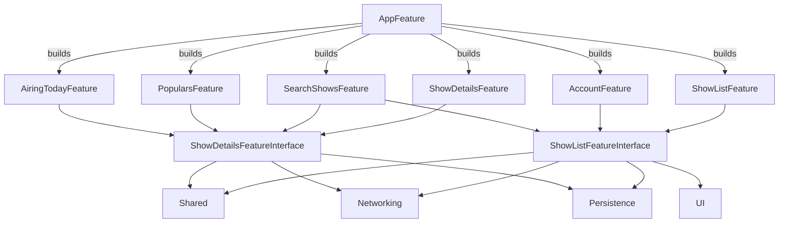

# TVToday

A modular iOS TV shows app built with Swift async/await, Clean Architecture, MVVM, and Coordinators, powered by the [TMDb API](https://www.themoviedb.org/).

TVToday is a learning-focused project that demonstrates how to structure a medium-sized iOS app using Swift Package Manager, feature modules, and a clear separation of concerns. Each feature is a standalone module with its own DI container and coordinator, making the code easier to test, navigate, and evolve.

## Key features
- Feature-based modular architecture (SPM)
- Clean Architecture + MVVM + Coordinator pattern
- Swift async/await networking
- Core Data persistence
- Snapshot + unit tests
- Dynamic Type and Dark/Light Mode support
- English and Spanish localization

## Architecture at a glance
- App entry: `AppFeature` composes the app and builds feature coordinators
- Feature modules: each module exposes a `Module` entry point and its own DI container
- Navigation: Coordinators per feature, with shared builders for cross-feature flows
- Infrastructure: shared modules for networking, persistence, and UI

## Module map
Feature modules:
- `AiringTodayFeature`
- `PopularsFeature`
- `SearchShowsFeature`
- `AccountFeature`
- `ShowDetailsFeature`
- `ShowListFeature`

Shared modules:
- `Networking`
- `NetworkingInterface`
- `Persistence`
- `PersistenceLive`
- `Shared`
- `UI`
- `KeyChainStorage`

## Dependency graph (high level)

## Why modularization?
This project shows how modularization can improve build times, test isolation, and team ownership. Each feature can be developed, tested, and demoed in isolation without rebuilding the entire app.

## Who this is for
- iOS developers learning modular architectures with Swift Package Manager
- Engineers migrating from Combine/Rx to async/await
- Anyone looking for a practical Clean Architecture + MVVM + Coordinator example

## Project status
- ✅ Migrate Networking layer from Combine to Async await
- ✅ Localize UI and requests to endpoint
- ✅ Support Dynamic Type
- ✅ Improve UseCases and Repositories use (Clear separation between Repositories and DataSources)
- ✅ Moving from Realm to Core Data
- ✅ Add demo apps for feature modules.
- ✅ Fix testability on Schedulers
- ✅ Migrate from RxDataSources to UICollectionViewDiffableDataSource
- ✅ Migrate from RxSwift to Combine

## Built with
- Swift 5
- Async-await
- Clean + Modular Architecture
- Coordinator Pattern.
- MVVM
- Dependency Injection
- Kingfisher
- Core Data
- KeychainSwift
- Swift Package Manager
- Dark Mode support
- Dynamic Type support
- English and Spanish Localized

## Requirements
1. Xcode 15.0+

## Getting started
1. Clone this repository.
2. Open `App/TVToday.xcodeproj` and have fun.

## Testing
- I use plain tests and Snapshot tests
- Check the test Plan associated to the AppFeature to run all the availabe tests

## Snapshot Tests
Last snapshot tests were created using an Apple Silicon with `Xcode 15.0`, Simulator `iPhone SE (3rd generation) iOS 17.0 (21A328)`
> ⚠️ Warning: Snapshots must be compared using the exact same simulator that originally took the reference to avoid discrepancies between images.

## Project evolution
- Monolith: https://github.com/rcaos/TVToday/releases/tag/v0.3.0
- RxSwift + CocoaPods : https://github.com/rcaos/TVToday/releases/tag/v.0.4.0
- RxSwift + SPM + Tuist: https://github.com/rcaos/TVToday/releases/tag/v0.5.0
- Combine + SPM + Tuist https://github.com/rcaos/TVToday/releases/tag/v0.6.0
- Combine + SPM https://github.com/rcaos/TVToday/releases/tag/v.0.7.0
- Current branch: Async-await + SPM

## Screenshots

### Dynamic Type

## Dark Mode

## Light Mode

## Keywords
Swift, iOS, modular architecture, SPM, async/await, Clean Architecture, MVVM, Coordinator, dependency injection, Core Data, TMDb, snapshot testing

# Author
Jeans Ruiz

https://jeansruiz.com
